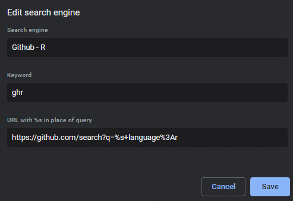
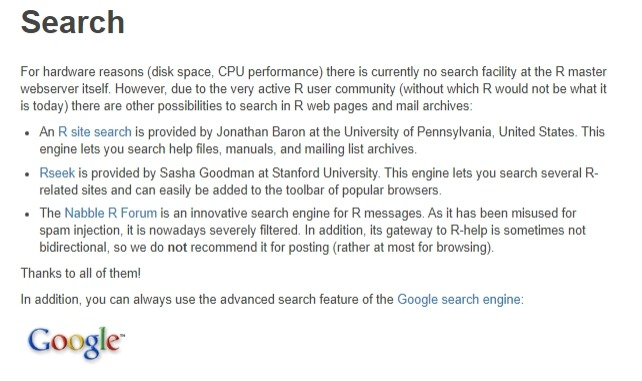

<aside>
```{r codefolder, echo=FALSE, results='asis'}
codefolder::distill(init = "hide")
```
</aside>

```{r setup, include=FALSE}
knitr::opts_chunk$set(
  echo = TRUE,
  error = FALSE,
  warning = FALSE,
  message = FALSE
)

library(markdown)
library(knitr)
library(rmarkdown)
```

## Introduction

- Skip to [the R code examples](#r-code).

***

Programmers are good at engineering software and designing web applications.
I argue that we can apply the same logic to facilitate an environment which provides
a natural, orchestrated flow between the various activities we undertake,
both online and in the console.

In this post I use searching the web, a process developers rely on heavily for
many different reasons, as a basic example of an area for improvement.

I will show you some examples of querying specific search engines
directly from your R console as well as provide some pre-configured functions
for some of my most common use-cases.

Before showcasing the code, first I want to bring to light some ideas
surrounding our daily workflows as developers and how we interact with the web.

### Your Mind is a CPU

> “The optimal number of threads in any system is one thread.” - Scott Hanselman

Think of your mind as a CPU (central processing unit) like that on your computer.
Each separate task you pursue throughout the day relies on a limited
amount of resources, which can be thought of as your bank of available  
*Random Access Memory*, or RAM.

From this perspective, the idea of multi-tasking becomes *multi-threading*,
and as developers we all know that for computers to run asynchronous,
parallel, multi-threaded processes requires a highly intricate, well
designed, and deeply thought out infrastructure to work properly
without overloading the CPU and crashing the machine.

Similarly, switching contexts between different digital environments
causes your mind to have to continuously re-adjust and reboot its underlying
resources in order to facilitate the influx of new information in need of being
processed.

In other words, it takes time, energy, and resources to get your mind to focus,
and every time we switch tasks or contexts, we lose energy that wouldn't have
been lost if we had just stayed in one context initially. The fatigue that builds
up from all of this energy loss can potentially demotivate us,
as well as cause mental burnout.

Programmers should strive to reach a **state of flow** in which complete focus
can be given to one activity.

This requires determination and discipline in order to keep that focus
streamlined as well as a proper environment which motivates focus
instead of scattered, distracted thought.

The solution to avoiding burnout and unproductive programming
habits is to provide an ecosystem where context switching is
minimized and when needed, streamlined.

## Searching from R

### Identifying an Opportunity 

Have you ever wanted to search google directly from R? What about query your
organizations Github repos or search for packages on your respective CRAN mirror?

This thought never crossed my mind until I took a second to think about the potential
benefits of constructing a system for implementing this in R.

The problem I found was two-fold:

1. Searching the web for R specific resources can be frustrating, time-consuming, and difficult.
2. The process of switching contexts from R to the browser is unproductive and breaks my natural development flow.

Identifying these issues, I took it as an opportunity to create something new, and potentially beneficial to others
as we developers love to do.

### Reviewing Current Processes

Although most R developers are extensively familiar with
[The DRY Principle](https://en.wikipedia.org/wiki/Don%27t_repeat_yourself) (*Don't repeat yourself*)
in programming, many do not attempt to extend the principle outside of their
code.

Thinking on the principle further, I realized that the amount of time developers
interact with the web through a web browser interface is much larger than we
may think and is only growing as our dependence on online services and learning
resources increase exponentially.

For me, the idea of searching from your command prompt or terminal stemmed from
my repetitive need to search online for some form of information whilst in the
midst of a programming endeavor. While there are many amazing API's, SDK's, and
localized web-oriented frameworks allowing developers to interact with the web
from their console, I found myself in need of a more general, simplistic
approach to querying information hosted online from my local machine.

Once I stopped to think about my daily processes while developing locally and
interacting with the internet, I quickly realized that there is a much larger
frequency of instances where I am in need of browsing the web than I originally
would have anticipated. Whether navigating to my web browser to google a new
concept, review a Github pull request, or even launch a locally hosted shiny
application, I found that I use my browsers constantly throughout the day.

To name a few examples:

- Reviewing a new pull request on Github or searching my backlog of issues assigned to me
- Searching for new software or downloading a new version
- Searching my cloud storage drives for files or data
- Searching my emails for important information
- Reviewing online documentation when learning something new
- Retrieving a forgotten API Key or account password
- Checking on and maintaining a hosted cloud service platform
- Watching a demo video on youtube for a new application
- Checking my RSS feeds and developer blogs to stay up to date on current news
- Searching google for a new library, concept, or framework
  
As you can see, there are a variety of instances where interacting with and
querying the web has become a routine in our daily development workflows
and learning processes.

Additionally, due to the lack of a more streamlined, self-contained
approach to this reliance on the web while programming, I found myself
easily distracted my all of the bells and whistles the internet and my
browsers have to offer. Between all of the bookmarks, feeds, notifications
and variety of browser extensions the simple process of leaving your
code and opening your browser has much larger implications than most people realize.

While this may seem like a minimal interruption to your programming workflow,
the fact of the matter is that programming is a form of work which requires
a very deep, specific environment and mindset in order to keep your
development pipelines productive and efficient. In other words,
programming is not easy and requires intense focus.

Therefore, developers should do everything they can
to avoid having to switch in and out of the various shallow
contexts surrounding our everyday lives while attempting
to perform a session of productive coding.

### Developing a Solution 

#### Browser Search Engines

To provide a simple, yet powerful solution to the issues surrounding browsing the
internet for necessary resources, I started with my personal browser settings.

Most web browser providers facilitate a setting where you can configure your own custom
configurations for creating search queries to specific web sites using your
address bar.

For example, in Chrome if you navigate to Settings > Manage Search Engines you will see
a list of default search engine providers such as google, bing, and yahoo as well as
some auto-generated engines created by websites you have visited in the past such
as Youtube or Medium.

What most people do not realize is they can add [add their own search engines and keywords](https://www.thewindowsclub.com/search-any-website-directly-from-the-chrome-or-edge-address-bar) also.

For example, if I want to search Github repositories querying with a specific keyword while
filtering for only repositories categorized with the language *R* the query URL would be:
`https://github.com/search?q=%slanguage%3Ar`.

You can produce this yourself by searching from Github and applying the filters 
yourself and replacing the term you searched for with `%s`, similar 
to the `sprintf` context. Lastly, assign a keyword of `ghr` and test it out by 
typing `ghr` in your address bar and pressing tab or enter. Now when you search 
it will direct you to Github R repositories!

Example: Search Github for `tidyverse` with keyword `ghr` filtering for `Language:R`:


note that this is setup with the following in <chrome://settings/searchEngines>:



***

Building on this framework I setup in my browser years ago, I decided to take it one step
further by bringing the searching functionality to my personal R package 
[browsr](https://github.com/jimbrig/browsr) focusing on R-specific
search engines (it can be quite difficult to search effectively for R
resources filtering out everything else given R is only one letter).

### Setting up the Search Engines

For setting up the search engines all I needed to do was migrate my browser
customized search engine URL's into R by wrapping them in R functions which pass
the `%s` syntax as a function argument.

Here is a list of the search engines I have implemented so far and their functions:

- General Search Function
- Search Github
- Search RSeek.org
- Search Finzi's R Site
- Search the R Forum on Nabble
- Search Google
- Search R-Project Domain from Google
- Search METACRAN

### Examples

Here is a list of some common examples:

- Gmail: `https://mail.google.com/mail/ca/u/0/#apps/%s`
- YouTube: `https://www.youtube.com/results?search_query=%s&page={startPage?}&utm_source=opensearch`
- Facebook: `https://www.facebook.com/search/top/?q=%s&opensearch=1`
- Twitter: `https://twitter.com/search?q=%s`
- SoundCloud: `https://soundcloud.com/search?q=%s`
- Amazon: `https://www.amazon.in/s/ref=nb_sb_noss_2?url=search-alias%3Daps&field-keywords=%s`

Some may find it useful to create custom github queries for their Github accounts:

- Your personal Github repositories: `https://github.com/<GITHUB_USERNAME>?tab=repositories&q=%s`  
- Your organizations Github repositories: `https://github.com/search?q=org%3A<GITHUB_ORGANIZATIoN>+%s`  

#### Example Tables {.tabset .tabset-fade .tabset-pills}

##### General

| Search Engine | Keyword  | Query URL                  |
|---------------|----------|----------------------------|
| Edge Settings | settings | `edge://settings/?search=%s` |
| Edge History | hist | `edge://history/all?q=%s`|
| Gmail Inbox Search | gmail | `https://inbox.google.com/search/%s` |
| Google Drive | gdrive | `https://drive.google.com/drive/u/0/search?q=%s` |
| Github | gh | `https://github.com/search?q=%s&ref=opensearch` |
| Github Gist | gist | `https://gist.github.com/search?q=&ref=opensearch` |
| StackOverFlow | stackoverflow | `https://stackoverflow.com/search?q=%s` |
| Dev.to | devto | `https://dev.to/search?q=%s` |
| DevDocs | devdocs | `https://devdocs.io/#q=%s` |

##### Developer Resources

And some more general developer resources:

| Search Engine | Keyword  | Query URL                  |
|---------------|----------|----------------------------|
| [Github](https://github.com/) | gh | `https://github.com/search?q=%s&ref=opensearch` |
| [Github Gist](https://gist.github.com/) | gist | `https://gist.github.com/search?q=&ref=opensearch` |
| [StackOverFlow](https://stackoverflow.com/) | stackoverflow | `https://stackoverflow.com/search?q=%s` |
| [Dev.to](https://dev.to/) | devto | `https://dev.to/search?q=%s` |
| [DevDocs](https://devdocs.io/) | devdocs | `https://devdocs.io/#q=%s` |
| [Mozilla WebDocs](https://developer.mozilla.org/en-US/) | mozdocs | `https://developer.mozilla.org/en-US/search?q=%s&w=3&qs=plugin` |

##### R-Resources

The [R-Project Website](https://www.r-project.org/) provides some useful search 
engines [here](https://www.r-project.org/search.html):

<center>


</center>

Taking these references as a starting point we can create some query URLs for 
searching R specifically: 

***

| Search Engine | Keyword  | Query URL                  |
|---------------|----------|----------------------------|
| [R Site Search by Finzi](http://finzi.psych.upenn.edu/search.html) | rsite | `http://finzi.psych.upenn.edu/cgi-bin/namazu.cgi?query=%s&max=100&result=normal&sort=score&idxname=functions&idxname=views` |
| [RSeek](https://rseek.org) | rseek | `https://www.rseek.org/?q=%s` |
| [R Nabble Forum](http://r.789695.n4.nabble.com/) | rnabble | `https://r.789695.n4.nabble.com/template/NamlServlet.jtp?macro=search_page&node=789695&query=%s` |
| [Advanced Google Search: R Project](http://www.google.com/advanced_search) | rproj | `https://www.google.com/search?q=%s&domains=r-project.org&sitesearch=r-project.org&btnG=Google+Search` |

##### Additional R

Additionally, I have created these R related search queries as well:

| Search Engine | Keyword  | Query URL                  |
|---------------|----------|----------------------------|
| [Github - Language:R](https://github.com/search?q=language%3Ar) | ghr | `https://github.com/search?q=%slanguage%3Ar` |
| [Github Gist - Language:R](https://gist.github.com/search?q=language%3Ar&ref=searchresults) | gistr | `https://gist.github.com/search?q=%s+language%3Ar&ref=searchresults` |
| [StackOverFlow - Tag:R](https://stackoverflow.com/search?q=%5Br%5D) | stackoverflowr | `https://stackoverflow.com/search?q=%5Br%5D+%s` |
| [METACRAN](https://www.r-pkg.org/) | metacran | `https://www.r-pkg.org/search.html?q=%s` |
| [Dan Goldstein's Site](http://www.dangoldstein.com/search_r.html) | danr | `http://www.dangoldstein.com/search_r.html?cx=partner-pub-8815643643661420%3Al9jc9v-e2vi&cof=FORID%3A10&ie=ISO-8859-1&q=%s&sa=Search&siteurl=www.dangoldstein.com%2Fsearch_r.html&ref=search.r-project.org%2F&ss=265j35153j3`
| [R Documentation](http://rdocumentation.org/) | rdocs | `http://rdocumentation.org/` |
| [R Package Documentation - Packages](https://rdrr.io/find/) | rdrrpkg | `https://rdrr.io/find/?repos=cran%2Cbioc%2Crforge%2Cgithub&fuzzy_slug=%s` |
| [RStudio Website](https://rstudio.com/) | rstudio | `https://rstudio.com/#stq=%s&stp=1` |
| [R-Bloggers](https://www.r-bloggers.com/) | rbloggers | `https://cse.google.com/cse?cx=005359090438081006639%3Apaz69t-s8ua&ie=UTF-8&q=%s&sa=Go` |


## R Code {.tabset .tabset-fade .tabset-pills #r-code}

Online Reference: <https://jimbrig.github.io/browsr/reference/search.html>

***

### General Search Engine

```{r search_online, eval=FALSE}

#' Generalized Search and Search Engine Examples
#'
#' Use these functions to search the web directly from your browser,
#' building advanced queries and supplying common useful R related domains.
#'
#' @param s string to search for (`%s` in the query URL)
#' @param query_url string representing the URL to query; defaults to Google
#'
#' @name search
#'
#' @keywords search_engines
#'
#' @export
#'
#' @examples
#' library(browsr)
#' # default search on google
#' search_online("polished.tech")
#'
#' # search github (note: &ref=opensearch)
#' search_online("polished", "https://github.com/search?q=%s&ref=opensearch")
#'
#' # search Github with language:r, org:tychobra for 'polished' (note: '%3A' represents a ':')
#' search_online("polished", "https://github.com/search?q=%s+language%3Ar+org%3Atychobra")
search_online <- function(s,
                          query_url = "https://google.com/search?q=") {

  url <- paste0(query_url, s)

  utils::browseURL(url)

}

```

### Search Github


```{r search_github, eval=FALSE}
#' Search Github
#'
#' Query Github's internal search engine.
#'
#' @param s string to search for
#' @param type what to search for, see details for options
#' @param language optional language filter
#' @param topic optional topic filter
#' @param user optional user filter
#' @param org optional org filter
#'
#' @describeIn search
#'
#' @export
#'
#' @examples
#' search_gh("websocket", language = "r", topic = "rshiny")
#'
#' # search your org
#' search_gh("polished", org = "tychobra")
search_gh <- function(s,
                      type = "all",
                      language = NULL,
                      topic = NULL,
                      user = NULL,
                      org = NULL) {

  types <- c("all",
             "repo",
             "code",
             "commit",
             "issue",
             "discussion",
             "package",
             "marketplace",
             "topic",
             "wiki",
             "user")

  match.arg(type, types)
  type_query <- ifelse(type == "all", "&ref=opensearch", paste0("&type=", type))
  base_url <- "https://github.com/search?q="
  lang_query <- ifelse(is.null(language), "", paste0("+language%3A", language))
  topic_query <- ifelse(is.null(topic), "", paste0("+topic%3A", topic))
  user_query <- ifelse(is.null(user), "", paste0("+user%3A", user))
  org_query <- ifelse(is.null(org), "", paste0("org%3A", org))
  query <- paste0(s, " ", lang_query, topic_query, user_query, org_query, type_query)

  url <- paste0(base_url, query)

  utils::browseURL(url)

}
```

### Rseek.org

```{r search_rseek, eval=FALSE}

#' Search RSeek.org
#'
#' Query a search on [rseek.org](https://rseek.org/).
#'
#' @param s string to search for
#' @export
#'
#' @describeIn search
#'
#' @references
#' - <http://www.sashagoodman.com/>
search_rseek <- function(s) {
  url <- paste0("http://www.rseek.org/?q=", s)
  utils::browseURL(url)
}
```


### Search R Site via Finzi

```{r search_finzi, eval=FALSE}
#' Search Finzi
#'
#' @param s string to search for
#'
#' @describeIn search
#'
#' @references
#' - <http://finzi.psych.upenn.edu/search.html>
#' - <http://finzi.psych.upenn.edu/search/manual.html#query>
#'
#' @export
search_finzi <- function(s) {

  url <- paste0(
    "http://finzi.psych.upenn.edu/cgi-bin/namazu.cgi?query=",
    s,
    "&max=100&result=normal&sort=score&idxname=functions&idxname=views"
  )

}
```

### Search Nabble R Forum

```{r search_nabble, eval=FALSE}
#' Search Nabble R Forum
#'
#' Query a search on the R Nabble Forum. Nabble is an innovative search engine
#' for R messages.
#'
#' @describeIn search
#'
#' @param s string to search for
#'
#' @export
#' @references
#' - <https://cloud.r-project.org/search.html>
#' - <http://n4.nabble.com/help/Answer.jtp?id=31>
search_nabble <- function(s) {

  url <- paste0(
    "https://r.789695.n4.nabble.com/template/NamlServlet.jtp?macro=search_page&node=789695&query=", s
  )

  utils::browseURL(url)

}
```

### Search Google

```{r search_google, eval=FALSE}

#' Search Google
#'
#' @describeIn search
#'
#' @param s string to search for
#' @export
search_google <- function(s) {
  url <- paste0("https://www.google.com/search?q=", s)
  utils::browseURL(url)
}
```

### Search R Project Domain via Google

```{r search_rproject, eval=FALSE}
#' Search R Project Domain on Google
#'
#' @param s string to search for
#'
#' @describeIn search
#'
#' @export
#'
#' @details See <https://cloud.r-project.org/search.html> which showcases Google's
#'   advanced search feature to query only R-Project domain sites via the
#'   [Google Search Engine](http://www.google.com/advanced_search).
search_rproject <- function(s) {

  url <- paste0(
    "https://www.google.com/search?q=", s,
    "&domains=r-project.org&sitesearch=r-project.org&btnG=Google+Search"
  )

  utils::browseURL(url)

}
```


### Search METACRAN


```{r search_metacran, eval=FALSE}
#' Search METACRAN
#'
#' @param s string to search for
#'
#' @describeIn search
#'
#' @export
search_metacran <- function(s) {

  url <- paste0(
    "https://www.r-pkg.org/search.html?q=", s)

  utils::browseURL(url)

}
```

## Concluding Remarks

Download the source code from the [Github Repository]().

Although I do use other terminals, languages, and shells outside of the R
environment, most of my development work is done within R and RStudio.
Therefore, I chose R as my framework for implementing a set of utility
functions to quickly perform advanced search queries online from a wide
variety of search engine source domains.

Similar R Packages: 

- [searcher](https://github.com/r-assist/searcher) 
- [websearcher](https://github.com/fschaffner/websearchr)
- [packageFinder](https://cran.r-project.org/package=packagefinder)
- `tools::CRAN_package_db()` from the tools package


