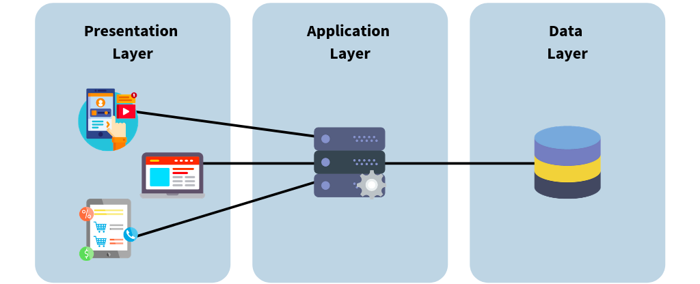
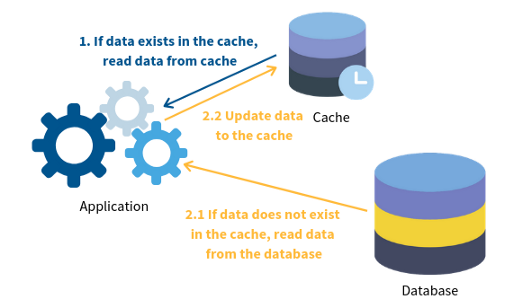

```{r setup, include=FALSE}
knitr::opts_chunk$set(
  warning = FALSE,
  message = FALSE,
  fig.path = "figs/",
  fig.width = 7.252,
  fig.height = 4,
  comment = "#>",
  fig.retina = 3,
  R.options = list(width = 60)
)
```

## Introduction

The R ecosystem provides an assortment of options and libraries for implementing `caching` into one's data-related workflows, for example:

- [memoise]()
- [cachem]()
- [Rcache]()
- [cacher]()
- [storr]()

plus many others.

However, there seems to be a slight lack in support for `caching` with regard to cloud hosted workflows and web applications. 

## Typical Web Application's Architecture

As an example, take a typical web-application architecture where the process is segmented into three separate layers: 


This generalized architecture is deemed the *Three-Tier Architecture* and is a model generally used by app developers to create flexible and reusable applications.

Broken down, the three layers are:

1. **Presentation Layer** - the interface the end-user interacts with. Its primary duty is to translate tasks and results from servers into output that the end-user can understand. In short, this tier is the *User Interface* or *client*.

2. **Application Layer** - primary coordinator of the back-end of the application. This tier processes commands, makes logical decisions and processes data between the end user-interface and the back-end database. In short, this tier is the *business logic*.

3. **Data Layer** -  simply put, this tier is where data is stored and accessed by the application layer. This tier composes of the various data stores needed by the application to access and retrieve data used in both previously mentioned layers, i.e. *databases and cloud storage*.

A benefit of the three-tier architecture is that each layer can work and be maintained, developed, and tested in isolation, independent of the other layers. Therefore every time the application queries for data, the speed is limited by network performance.

Data retrieval time plays a key role in overall user experience (UX) and is a critical requirement for most large applications meant for production. 

### Database Caching Overview

Caching is a buffering technique that stores frequently-queried data in a temporary memory. It makes data easier to be accessed and reduces workloads for databases. For example, you need to retrieve a user’s profile from the database and you need to go from a server to server. After the first time, the user profile is stored next (or much nearer) to you. Therefore, it greatly reduces the time to read the profile when you need it again.

The cache can be set up in different tiers or on its own, depending on the use case. It works with any type of database including both *Relational* and *NoSQL* Databases.

## Benefits of Caching

- **Performance** — Performance is improved by making data easier to be accessed through the cache and reduces workloads for database.

- **Scalability** — Workload of back-end query is distributed to the cache system which is lower costs and allow more flexibility in processing of data.

- **Availability** — If back-end database server is unavailable, cache can still provide continuous service to the application, making the system more resilient to failures.

Overall, it is the minimally invasive strategy to improve application performance by implementing caching with additional benefits of scalability and availability.

There are many implementations of caching in modern application frameworks including:

- *Cache Aside*
- *Read Through*
- *Write Through*
- *Write Back*
- *Write Around*

For example here is an architectural diagram of the *Cache Aside* workflow:



***

Ok so now moving onto caching in relation to R:

## Caching in Shiny

Recently, the [shiny]() package introduced new functions that aid in caching: `bindCache` and `renderCachedPlot`.

- `renderCachedPlot()` requires `shiny` version 1.5.0 or higher.

- `bindCache()` requires `shiny` version 1.6.0 or higher.

## Adding a Cache Layer Between Application and Database

[Redis]() is the most commonly used back-end for implementing a caching layer between the application and database in production, and it is pretty awesome. 

One can easily spin up a local Redis backend using docker as follows:

```bash
docker run --rm --name redisbank -d -p 6379:6379 redis:5.0.5 --requirepass bebopalula
```

This will run a redis container at `localhost` exposed to port `6379` (Redis' typical port).

Next, you can add a redis cache to your R workflow using a generated `R6` object that represents the `redis_cache` created with the `bank` package in conjunction with the `memoise` package as so:

*Note: the `redux` package will be required to implement the `redis_cache` R6 object here*

```R
library(bank)
library(memoise)

redis_cache <- bank::cache_redis$new(password = "bebopalula")

f <- function(x) {
  sample(1:1000, x)
}

mf <- memoise::memoise(f, cache = redis_cache)

mf(5)

mf(10)
```

and inside Shiny:

```R
ui <- fluidPage(
  # Creating a slider input that will be used as a cache key
  sliderInput("nrow", "NROW", 1, 32, 32),
  # Plotting a piece of mtcars
  plotOutput("plot")
)

server <- function(input, output, session) {
  output$plot <- renderCachedPlot(
    {
      # Pretending this takes a long time
      Sys.sleep(2)
      plot(mtcars[1:input$nrow, ])
    },
    cacheKeyExpr = list(
      # Defining the cache key
      input$nrow
    ),
    # Using our redis cache
    cache = redis_cache
  )
}
shinyApp(ui, server)
```

For a more involved shiny example you could use:

```R
generate_app(redis_cache)
```

Try it Out!


