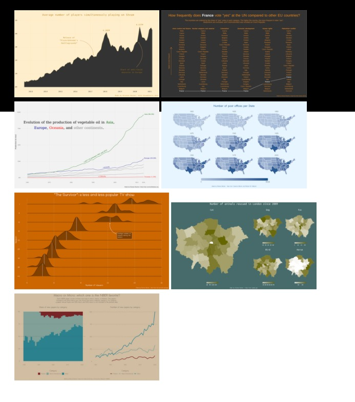

```{r setup, include=FALSE}
knitr::opts_chunk$set(echo = FALSE)
```

While developing and designing software projects in R it is very common
to have to deal with various images and the process of manipulating,
re-sizing, cropping, and dealing with these images can be a huge pain
and waste of time.

## Examples of Pain Point with Images

Some examples of the pain points when dealing with images are:

-   Dealing with image formats and file extensions
-   Having to remove backgrounds from images to make them transparent
-   Resizing images to fit properly into your webapp
-   Creating thumbnails and icons from the image for various design
    layouts
-   etc.

## The `magick` Package

Recently I finally decided to take a gander into the popular [magick]()
R library.

This package is a swiss-army-knife for dealing with images in R.

A good place to start is the `image_resize` function which allows you to
resize the dimensions of your images. To add to that, let's create a
function allowing one to:

1.  Read in an image file: `magick::image_read`
2.  Resize that image: `magick::image_resize`
3.  Save the image back to file: `magick::image_write`

```{r resize_image_function}
library(magick)

resize_image <- function(image, pct = "6%") {
  ext <- tools::file_ext(image)
  image_file <- magick::image_read(image)
  image_resized <- magick::image_resize(image_file, pct)
  magick::image_write(image_resized, paste0(image, "-thumb.", ext))
}
```

## Creating a Gallery of Images

```{r gallery}
make_gallery_layout <- function(img_path) {
  
  images <- list.files(img_path)
  images_full_size <- grep("thumb", images, value = TRUE, invert = TRUE)
  images_thumb <- grep("thumb", images, value = TRUE)
  
  layout <- tagList(
    purrr::map2(images_full_size, images_thumb, function(full, thumb) {
      tags$a(
        href = paste0(img_path, "/", full),
        tags$img(src = paste0(img_path, "/", thumb))
      )
    })
  )
  
  withTags(
    div(
      class = "row",
      id = "lightgallery",
      tagList(layout)
    )
  )

}
```

### Spice up the Gallery with Custom CSS and Javascript

-   [lightgallery.js]()

HTML Head needs:

``` html
<head>

<link type="text/css" rel="stylesheet" href="https://cdnjs.cloudflare.com/ajax/libs/lightgallery/1.6.0/css/lightgallery.min.css" />
<script src="https://cdnjs.cloudflare.com/ajax/libs/lightgallery-js/1.4.1-beta.0/js/lightgallery.min.js"></script>

<!-- lightgallery plugins -->
<script src="https://cdnjs.cloudflare.com/ajax/libs/lg-fullscreen/1.2.1/lg-fullscreen.min.js"></script>
<script src="https://cdnjs.cloudflare.com/ajax/libs/lg-thumbnail/1.2.1/lg-thumbnail.min.js"></script>

</head>
```

Plus the following CSS customization:

``` css
#lightgallery > a > img:hover {
   transform: scale(1.15, 1.15);
   transition: 0.4s ease-in-out;
   cursor: pointer;
}
```

## Result


