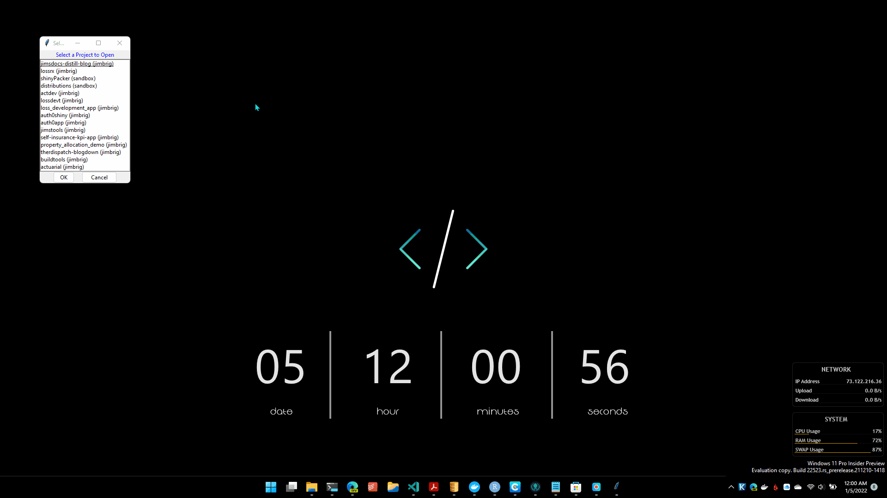

```{r setup, include=FALSE}
knitr::opts_chunk$set(echo = FALSE)
```

Want to increase your developer productivity? How bout a quick and easy
way to list, prioritize, and launch your R Projects from *anywhere on
your machine, whether RStudio is open or not.*

To start with the end in mind here is a quick demo of the allmighty **R
Project Launcher** I created:

<center>



</center>

``` R
```

I have found the best way to accomplish this (as opposed to the norm) is
to *identify an area to enhance* and **create your own personalize
solution to that problem**. This differs from the typical route of
utlizing someone else's creation or package/library.

I chose to solve

------------------------------------------------------------------------

Distill is a publication format for scientific and technical writing,
native to the web.

Learn more about using Distill at <https://rstudio.github.io/distill>.
